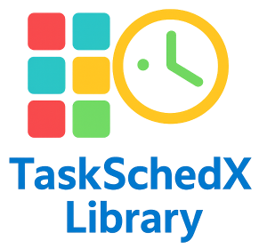

# TaskSchedX Library




## Project Description

The **TaskSchedX Library** is a high-performance C++11+ task scheduling and execution framework for multithreaded applications. It provides robust, thread-safe capabilities for scheduling and executing tasks based on **priority**, **timing**, **recurrence**, and **timeout constraints**, making it ideal for:

- Real-time systems
- Background task orchestration
- Custom scheduling scenarios

## Key Features

### Core Scheduling Capabilities

- **Time-based Execution**: Schedule tasks at precise times (with millisecond accuracy)
- **Priority-based Ordering**: Tasks with lower priority numbers are executed first
- **Repeatable Tasks**: Automatically re-execute tasks at defined intervals
- **Task Cancellation**: Cancel tasks before execution
- **Timeout Handling**: Abort tasks that exceed execution time limits

> ❗ **Note**: *Task dependencies* are **not currently implemented**, though the system can simulate ordering using priorities and scheduled times.

### Performance & Concurrency

- **Thread Pool Execution**: Automatically managed worker threads with configurable size
- **Concurrency**: Tasks are distributed across threads for maximum throughput
- **Per-thread Naming**: Threads can be labeled for logging/debugging clarity (cross-platform)
- **Scalable**: Support for high task volumes

### Reliability & Monitoring

- **Robust Error Handling**: Task failures are caught without crashing the scheduler
- **Status Tracking**: Observe states like `PENDING`, `RUNNING`, `COMPLETED`, `FAILED`, `TIMEOUT`, and `CANCELLED`
- **Completion Callbacks**: Optionally register handlers to respond to task completion/failure
- **Real-time Logging**: Configurable log level and outputs
- **Comprehensive Statistics**: Monitor totals, success/failure rates, cancellations, and timeouts

### Advanced Functionality

- **Unique Task IDs**: Every task is assigned a unique identifier
- **Flexible Configuration**: Set timeouts, priorities, repetition intervals per task
- **Minimal Footprint**: C++11 standard with no heavy dependencies
- **RAII Compliance**: Automatic cleanup and resource safety

---

## Usage

### Setup

```cpp
#include "TaskScheduler.h"

TaskSchedX::TaskScheduler scheduler(4);
scheduler.enableConsoleLogging(true);
scheduler.setLogLevel(Logger::Level::INFO);
```

### Scheduling Tasks

```cpp
TaskSchedX::TaskConfig config;
config.executeFn = []() { std::cout << "Hello, Task!" << std::endl; };
config.startTime = std::chrono::system_clock::now() + std::chrono::seconds(2);
config.priority  = 1;
config.repeatable = false;
scheduler.scheduleTask(config);
```

### Repeatable Task

```cpp
TaskSchedX::TaskConfig repeatTask;
repeatTask.executeFn = []() { std::cout << "Tick..." << std::endl; };
repeatTask.repeatable = true;
repeatTask.repeatInterval = std::chrono::seconds(5);
scheduler.scheduleTask(repeatTask);
```

### Start & Stop

```cpp
// start scheduler in a dedicated thread
scheduler.start();

// your code
std::this_thread::sleep_for(std::chrono::seconds(20)); // do some work

scheduler.stop();
```

### Task Control & Scheduler statistics

```cpp
auto status = scheduler.getTaskStatus("task_id");
std::cout << "Task status: " << TaskSchedX::Task::status_to_string(status) << std::endl;

bool cancelled = scheduler.cancelTask("task_id");
std::cout << "cancellation task :" (cancelled ? "SUCCESS" : "FAILED") << std::endl;

auto stats = scheduler.getStatistics();
std::cout << "Total tasks scheduled: " << stats.totalTasksScheduled << std::endl;
std::cout << "Tasks completed: " << stats.tasksCompleted << std::endl;
std::cout << "Tasks failed: " << stats.tasksFailed << std::endl;
std::cout << "Tasks cancelled: " << stats.tasksCancelled << std::endl;
std::cout << "Tasks timed out: " << stats.tasksTimedOut << std::endl;

```

---

## Build & Run

| Action                | Command                                          |
|-----------------------|--------------------------------------------------|
| Configure             | `cmake -S . -B build`                            |
| Build Scheduler       | `cmake --build build --target task_scheduler`    |
| Build Examples        | `cmake --build build --target examples`          |
| Run All Examples      | `cmake --build build --target run_all_samples`   |
| Format Code           | `cmake --build build --target clang_format`      |
| Build Tests           | `cmake --build build --target tests`             |
| Run Tests             | `cmake --build build --target run_tests`         |
| Clean Build           | `cmake --build build --target clean`             |

## Code Coverage
This project supports code coverage reporting using `lcov`, `genhtml`, and `gcovr` via CMake custom targets. To enable coverage reporting:

1. Configure CMake with coverage enabled:
   ```sh
   cmake -B build -S . -DENABLE_COVERAGE=ON
   ```

2. Build the project and run unit tests:
   ```sh
   cmake --build build --target tests
   cmake --build build --target run_tests
   ```

3. Generate coverage reports using one of these targets:

   - **Show coverage summary in console:**
     ```sh
     cmake --build build --target gcovr_console
     ```
   - **Generate HTML report with gcovr:**
     ```sh
     cmake --build build --target gcovr
     # View the report at build/coverage_gcovr.html
     ```
   - **Generate HTML report with lcov/genhtml:**
     ```sh
     cmake --build build --target coverage
     # View the report at build/coverage_report/index.html
     ```


---

## Examples

Explore `examples/` for ready-to-run demonstrations:

| Category          | Example Folder                   | Description                                               |
|-------------------|----------------------------------|-----------------------------------------------------------|
| Getting Started   | `BasicUsage/`                    | Schedule and run basic tasks                              |
| Priority          | `PriorityScheduling/`            | Control task execution order                              |
| Repeatable        | `RepeatableTasks/`               | Setup periodic jobs                                       |
| Cancellation      | `TaskCancellation/`              | Cancel before or during execution                         |
| Timeout           | `TimeoutHandling/`               | Handle slow tasks and abort on timeout                    |
| Error Handling    | `ErrorHandling/`                 | Safely handle exceptions from tasks                       |
| Statistics        | `StatisticsMonitoring/`          | Real-time tracking of execution stats                     |
| Callbacks         | `CallbackMechanism/`             | Task-completion hooks and notifications                   |
| Performance       | `PerformanceBenchmark/`          | Benchmark throughput vs thread count                      |
| Scheduling Logic  | `CustomSchedulingPolicies/`      | Mix time-based, priority-based, and batch-based scheduling|

---

## Requirements

- C++11 or newer
- CMake ≥ 3.10
- GoogleTest (auto-downloaded)
- pthread (Linux/macOS; native threads on Windows)

---

## License

This project is licensed under the MIT License - see the [LICENSE](LICENSE) file for details.

---

## Contributing

Pull requests and ideas are welcome! Please ensure:

- All new logic includes unit tests
- Logging + status behavior are preserved
- Code follows style via `clang-format`
- Examples and `README` are updated

---

